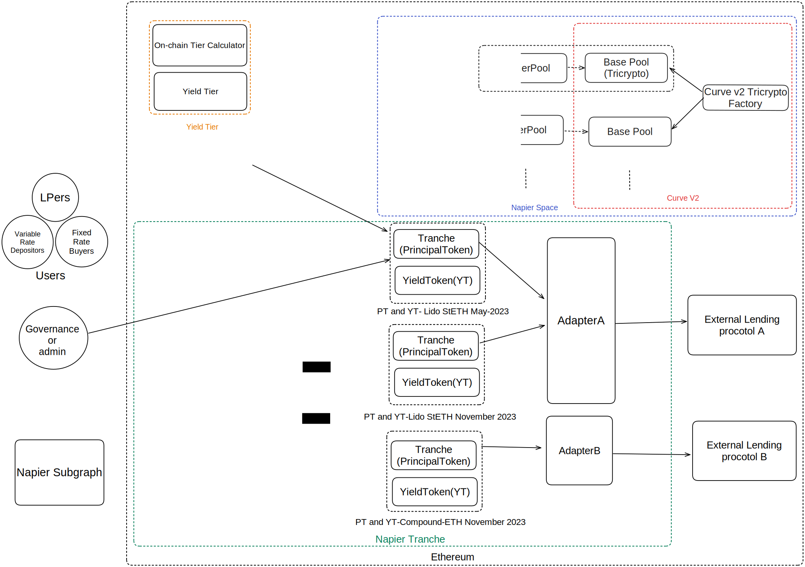

# Napier System Specification

## Problem statement

PRD: [here]

TL;DR

> Napier is a fixed-rate DeFi protocol that allows:
>
> 1. Swap large positions on the AMMs for traders.
> 2. Get higher APY for liquidity providers.

## Definitions

General:

| Term                 | Description                                                                                                             |
| -------------------- | ----------------------------------------------------------------------------------------------------------------------- |
| Governance           | Napier token governance system                                                                                          |
| Treasury             | Napier rewards mechanism/protocol dev fund                                                                              |
| CFMM                 | Abbreviation of Constant Function Market Maker.                                                                         |
| Management           | An account is in charge of monitoring its position for adverse effects.                                                 |
| Underlying           | Base asset (e.g., DAI, USDC, ETH, RAI...)                                                                               |
| Target               | Yield-bearing token of a yield source                                                                                   |
| Principal Token (PT) | Token that represents the principal amount of the Target. In traditional finance, it is equivalent to zero-coupon bond. |
| Yield Token (YT)     | Token that represents accrued yield and future yield.                                                                   |
| Adapter              | Wrapper for external protocol (e.g. Aave, Compound, etc.)                                                               |

User types:
| Term | Description |
| ------------------------ | ------------------------------------------------------------------------------------------------------------------------------------------------------------------------------------------------------------------------------------------------------------ |
| Fixed Rate Buyers | These are the users who **purchase** Principal Tokens at a discount facilitated by our AMMs. Users only earn a Fixed Rate if they **buy** Principal Tokens at a discount. Users who **mint** Principal Tokens and Yield Tokens are not earning a Fixed Rate. |
| Variable Rate Depositors | These are users who **deposit** their base asset (underlying token) into Napier to **mint** Principal Tokens and Yield Tokens, and then **sell** Principal Tokens on the Napier AMMs. |
| Liquidity Providers | These are users who provide liquidity into the Napier AMMs. Users require both Principal Tokens and the underlying token to provide liquidity into the fixed-rate AMM and will earn trading fees. |

## Goals

- Liquidity providers should get higher PY than other existing solution like Element fi and Sense fi.
<!-- - Pools are put together depending on risk profile, which should allow us to efficiently manage the risk of the pool. -->

## Non-goals

In version 1;

1.  Yield Tier is not implemented.
2.  Governance is not implemented.

## Proposed solution

Development scope:

1.  Napier Yield Stripping System: Minting Principal Token and Yield Token from yield-bearing token.
2.  Napier AMM: AMM for trading PT against Underlying.
3.  Napier Peripheries: Peripheries for Napier AMM and Yield Stripping System.
4.  Yield Tier: Valuation framework for interest-bearing token. It is a way to measure the quality of an interest-bearing token. The higher the YieldTier, the higher the quality of the interest-bearing token, which means that the interest-bearing token is less likely to be default.

## Yield Stripping System Specification

### Definitions

| Term         | Description                                                                |
| ------------ | -------------------------------------------------------------------------- |
| Tranche      | Contract that manages issuing and redeeming PT and YT.                     |
| Napier Space | Napier AMM and peripheries                                                 |
| Napier Pool  | Napier AMM for trading PT against Underlying                               |
| Scale        | Conversion rate of Target token in Underlying Token in units of Underlying |
| Yield Tier   | Valuation framework for an yield-bearing token.                            |

### Architecture

Mining system is composed of 3 types of Napier contracts and external dependencies.

1.  Adapter: Module that manages interaction with external protocol. (e.g. Aave, Compound, etc.)
2.  Tranche: Manages issuing and redeeming PT and YT.
3.  TrancheFactory: Factory contract for Tranche.

External dependencies:

1. Underlying
2. Yield-bearing token (Target) / Yield source

- Tranche - PT - YT: 1:1:1 relationship.
- PT - YT - maturity - adapter: 1:1:1 relationship. Each PT and YT pair has a unique maturity and an adapter.
- Adapter - Tranche: 1:N relationship.
- TrancheFactory - Tranche: 1:N relationship.

Protocol Invariants

1. Total supply of YT is always equal to total supply of PT if the Tranche is not expired.
2. Sum of redeemable Target by all PT and YT is always equal to Target balance of Tranche, subtracting issuance fee. (Solvency)

### Requirements of Underlying and Target

1. Underlying and Target MUST be ERC20 with less than or equal to 18 decimals.
2. Underlying and Target SHOULD be able to be converted each other at a constant rate. (no slippage)
3. Target MUST be non-rebasing token. (stETH is rebasing token, so we cannot use it as Target.)
4. Underlying MUST be non-rebasing token.
5. Underlying MUST NOT be ERC777 token.

### Adapter Specification

- Adapter CAN convert Underlying to Target and vice versa.
- The conversion rate SHOULD NOT depend on size of the conversion. (no slippage)
- Governance token rewards CAN be claimed by the "management".

### Tranche Specification

Tranche complies with [EIP5095 - Principal tokens (zero-coupon tokens) are redeemable for a single underlying EIP-20 token at a future timestamp.](https://eips.ethereum.org/EIPS/eip-5095).

1. A User is able to mint PT and YT by depositing Underlying only if the Tranche is not expired.
2. A User is able to redeem Underlying by burning PT and YT _at any time_.
3. A User is able to redeem Underlying by burning PT at/after the Tranche is expired.
4. A User is able to redeem Underlying by burning YT at/after the Tranche is expired.
5. A User is able to collect accrued yield depending on the Target performance.
6. Accrued yield MUST not depends on when Users collect it or how much Users collect it. It only depends on the Target performance since the User holds YT.
7. Nobody can not update maturity, adapter once the Tranche is deployed.
8. Only Management can collect issuance fee.
9. Only Management can pause/unpause interaction with the Tranche.

### Fees

1. The Management collects "issueance fee" in unit of Target based on deposted Target amount when Users mint PT and YT.

### Settlement

1. Settlement MUST be triggered by the first User who interacts with the Tranche at/after the Tranche is expired.
2. Scale at the time of settlement MUST be used to compute the amount of Underlying to be redeemed.

### Principal Token and Yield Token Specification

| Parameter    | Description                                                                        |
| ------------ | ---------------------------------------------------------------------------------- |
| Maturity     | Timestamp when the Tranche is expired.                                             |
| Adapter      | Adapter contract address.                                                          |
| Underlying   | Underlying token address.                                                          |
| Target       | Yield-bearing token address.                                                       |
| Issuance Fee | Fee rate when minting PT and YT.                                                   |
| Tilt         | A parameter that determines the percentage of principal reserved for Yield Tokens. |

1. Underlying token decimals MUST be less than or equal to 18.
2. PT and YT MUST be ERC20 with same decimals as its Underlying.
3. PT and YT MUST be non-rebasing token.
4. PT Must be burned when redeeming Underlying.
5. YT MUST be burned when redeeming Underlying.
6. Accrued yield MUST not transferred until Users explicitly claim it.
7. PT + YT is always equal to 1 Target.

### Math for PT and YT

[here](./Napier_Yield_Stripping_Math__1_.pdf)

### TrancheFactory Specification

1. Only Governance can deploy a new Tranche.
2. Same maturity and adapter cannot be deployed twice.

### Emergency Mode

Conditions that trigger Emergency Mode:

- TODO

## Napier AMM Specification

### Definitions

| Term        | Description                                                                    |
| ----------- | ------------------------------------------------------------------------------ |
| NapierSpace | Napier AMM and peripheries                                                     |
| Meta pool   |                                                                                |
| Base pool   | Curve Tricrypto v2 pool that allows Users to trades Principal Tokens. 3 Assets |

### Architecture

Napier AMM is composed of 3 types of Napier contracts and external dependencies.

1. NapierPool: Meta pool for trading PT against Underlying. Its pair is Curve pool (Base pool) LP token and its Underlying.
2. PoolFactory: Factory contract for NapierPool.
3. SwapRouter: Router contract for NapierPool.

NapierPool depends on:

1. Underlying
2. Curve Tricrypto v2 pool (Base pool)

SwapRouter depends on:

1. NapierPool
2. Tranche
3. PoolFactory
4. Curve Tricrypto v2 pool

- NapierPool - Curve Tricrypto v2 pool: 1:1 relationship.
- SwapRouter - NapierPool: 1:N relationship.
- PoolFactory - NapierPool: 1:N relationship.

Protocol Invariants

1.

### NapierPool Specification

Tokens in NapierPool: 1. Base pool LP token 2. Underlying

1. Base pool MUST follow Curve Tricrypto v2 pool specification below.
2. The Underlying MUST be the same as the Underlying of Principal Token within the Base pool.
3. A User is able to swap Base pool LP token and Underlying vice versa only if the Tranche is not expired.
4. A User is able to swap Principal Token in the Base pool and Underlying vice versa only if the Tranche is not expired.
5. A User is able to swap Base pool LP token and Underlying vice versa only if the Tranche is not expired.
6. A User is able to add liquidity to the Base pool and NapierPool only if the Tranche is not expired.
7. A User is able to remove liquidity from the Base pool and NapierPool _at any time._

### NapierPool AMM Math

The computing swap Base pool LP token and Underlying is completely based on Notional V2 AMM math. (Pendle V2 AMM Math)

Link:TODO

### Fees

- Liquidity providers can collect "swap fee" in unit of Underlying when Users swap Base pool LP token and Underlying vice versa.
- Only owner can collect "protocol fee" in unit of Underlying from collected "swap fee".
- Only owner can set swap fee rate for NapierPool.
- Only Curve admin can set fee rate for Base pool. (Out of scope)

### NapierPoolFactory Specification

1. Only Governance can deploy a new NapierPool.
2. Same maturity and adapter cannot be deployed twice.

### Base pool Specification

1. Base pool MUST be Curve Tricrypto v2 pool.
2. Base pool MUST be initialized with 3 Principal Tokens.
3. Those 3 Principal Tokens MUST have common maturity and underlying with less than or equal to 18 decimals.
4. Those 3 Principal Tokens MUST be deployed by the same TrancheFactory.
<!-- 5. Those 3 Principal Tokens SHOULD have similar Yield Tier. -->

Note: It is impossible to prohibit trading Principal Token on Curve Pool at/after the Principal Tokens is expired.
But it is not economically incentivized to trade expired Principal Token on Curve Pool because the price of expired Principal Token is approximately equal to 1 Underlying in usual case.

## Napier Peripheries Specification

Peripheries handles complex operations between NapierPool and Tranches, and provides a simple interface for Users.

### SwapRouter Specification

1. A User is able to provide deadline for swap and slippage protection.
1. A User is able to swap/add liquidity with native ETH instead of WETH.
1. A User is able to swap YT for Underlying and vice versa with a single transaction.
1. A User is able to add liquidity to NapierPool from only Underlying token.
1. A User is able to remove liquidity from NapierPool to only Underlying token.
1. A User is able to add liquidity from a single Principal Token.
1. A User is able to remove liquidity to a single Principal Token.

### TrancheRouter Specification

1. A User is able to mint PT and YT by depositing native ETH instead of WETH.
2. A User is able to redeem Underlying by burning PT and YT _at any time_ and get native ETH instead of WETH.
3. A User is able to redeem Underlying by burning PT at/after the Tranche is expired and get native ETH instead of WETH.
4. A User is able to redeem Underlying by burning YT at/after the Tranche is expired and get native ETH instead of WETH.

## FAQ

1. **What is the meaning of "Sunny Day"?**

   - "Sunny Day" refers to scenarios where the Target hasn't lost significant value, preventing a reduction in value for Principal Token (PT) holders. For PT holders, a "Sunny Day" means receiving their fixed rate without any issues, as everything functions as expected.

2. **When is it considered a "Sunny Day"?**

   - It's considered a "Sunny Day" when the Target maintains its value without triggering a loss for PT holders, allowing them to receive their expected fixed returns.

3. **Why is the tilt value θ introduced, and for which tokens is it set to a non-zero value?**

   - The tilt value θ, representing a portion of the principal belonging to Yield Tokens (YTs), is introduced as a protective measure. It's set to zero for standard tokens and assigned a non-zero value for tokens with a risk of losing value, such as yield-bearing assets facing potential negative yields or protocol issues. The tilt acts as a safeguard for PT holders, requiring YT holders to contribute capital to maintain the "Sunny Day" condition. A higher tilt increases the likelihood of sustaining the "Sunny Day" scenario for PT holders.

4. **Why is the scale value at maturity, $s(t_m)$, replaced with the maximum scale value, $S(t_m)$, in practical scenarios?**

   - In practice, the maximum scale value $S(t_m)$ is used instead of the actual scale value at maturity, $s(t_m)$. This approach is adopted to ensure fairness among YT holders. If the current scale value were used, YT holders who collect earnings first would benefit more, especially if the scale value decreases over time. Using the maximum scale value ensures equitable yield distribution for all YT holders, regardless of when they collect.

5. **Why is the amount of Yield Tokens calculated using the scale $s$?**
   - The amount of Yield Tokens is calculated based on the scale $s$ because PTs are redeemable at par value after maturity. This method ensures that Zero Tokens represent the equivalent underlying value of the target that can be claimed at maturity. The formula $x * s$ calculates the underlying value, with $s$ serving as the conversion rate from the target to the underlying asset.
