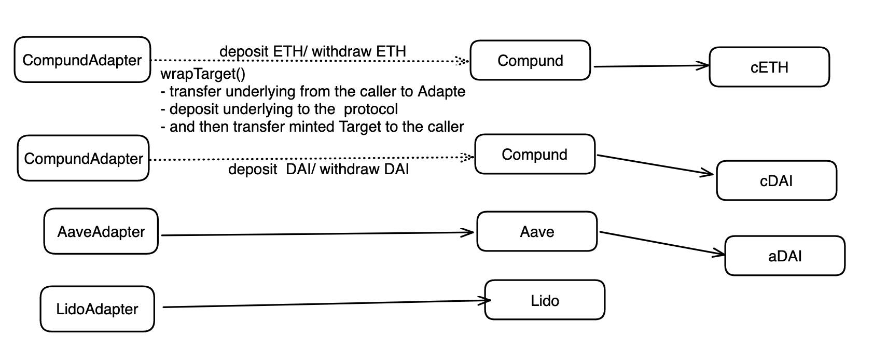

### Tranche

- Doing for what?
  - The Tranche contract serves as the user entry point for issuing and redeeming Principal Tokens (PTs) and Yield Tokens (YTs).
  - It splits a Target token into PTs and YTs, and vice versa.
  - Variable Rate Depositors interact with the Tranche contract to mint PTs and YTs.
- What methods are called?
  - The following methods are called by users.
    - Issue PT and YT `Tranche#issue` before the maturity
    - Combine PT and YT `Tranche#redeemWithYT` at any time
    - Redeem PT `Tranche#redeem` after the maturity
    - Collect accrued yield from YT `Tranche#collect` called by anyone.
    - Collect accrued yield from YT `Tranche#updateUnclaimedYield` called by `YieldToken`.
  - The following methods are called by TrancheFactory.
    - Set initial parameters `initialize`.
- Which methods this contract calls?
  - transfer `transferFrom` of Underlying and Target token
  - `mint` and `burn` PT and YT.
  - Convert Target to Underlying and vice versa via `Adapter` module
- Dependencies
  - Adapter
  - PT
  - YT
- Deployed by
  - TrancheFactory with CREATE2

Data Model

1. `maturity` - The UNIX timestamp when PT matures.
2. `target` - The address of Target token.
3. `pt` - The address of PT.
4. `yt` - The address of YT.
5. `adapter` - The address of Adapter.
6. `factory` - The address of `TrancheFactory`.
7. `maxscale` - The maximum value of `scale` that can be set every interactions.
8. `mscale` - The scale of the Target token at the time of maturity.
9. `issuanceFee` - The fee rate of issuance. The fee is charged when the user issues PT and YT.
10. `lscales` - The mapping of the user's address to the scale of the Target token at the last yield collection.
11. `management` - The address of team's multisig wallet.

Business Logic

1. Issuing PT and YT: Variable Rate Depositors deposits Underlying to Tranche and receives PT and YT.
   NOTE: Issuance fee is charged based on the amount of Target token used to mint PT and YT.
   1. User calls `Tranche#issue` with Underlying amount.
   2. Tranche transfers Underlying from user to Tranche.
   3. Collect accrued yield from YT if the user holds YT.
   4. Update the user's `scale` computed based on a math.
   5. Tranche calls `Adapter#prefundedDeposit` to convert Underlying to Target
   6. Tranche calls `mint` to mint PT and YT to user
   - Conditions that lead to errors and failures
     - Already matured
     - When not paused
     - User doesn't have enough Underlying to issue
2. Combining PT and YT: Users redeems PT and YT and receives Underlying deposited at issuance.
   1. User calls `Tranche#redeemWithYT` with PT amount.
   2. Collect accrued yield from YT if the callers holds YT.
   3. Tranche calls `burn` to burn PT and YT from the caller.
   4. Calculate Underlying amount to be unwrapped from Target
   5. Tranche calls `Adapter#prefundedRedeem` to convert Target to Underlying
   6. Tranche transfers Underlying to the caller.
   - Conditions that lead to errors and failures
     - PT and YT is not enough to burn
     - When not paused
3. Redeeming PT after its maturity: Fixed Rate Buyers redeem PT and receives Underlying.
   1. User calls `Tranche#redeem` with PT amount.
   2. Collect accrued yield from YT if the user holds YT.
   3. Tranche calls `burn` to burn PT. YT is not burned.
   4. Calculate Underlying amount to be unwrapped from Target
   5. Tranche calls `Adapter#prefundedRedeem` to convert Target to Underlying
   6. Tranche transfers Underlying to user
   - Conditions that lead to errors and failures
     - When not paused
     - Not matured yet
     - PT is not enough to burn
4. Collecting accrued yield from YT: YT holders collect accrued yield in Underlying.
   - NOTE: All accrued yield plus unclaimed yield is transferred to the `recipient` address.
   - If the maturity is passed, the YTs are burned.
   1. User calls `collect` with specified `recipient` address to receive accrued yield.
   2. Calculate accrued yield based on the user's YT balance and uesr's stored `scale`.
   3. Update the caller's `lscales`.
   4. If the maturity is passed, burn all YTs from the user.
   5. Tranche calls `Adapter#prefundedRedeem` to convert Target to Underlying
   6. Tranche transfers Underlying to user or `recipient` address if specified.
   7. Emit `Collect` event
   - Conditions that lead to errors and failures
     - When not paused
5. Updating unclaimed yield:
   - NOTE: To track accrued yield, when users transfer YTs to another user, `Tranche#collect` MUST be called to collect accrued yield.
   - NOTE: `collect` burns all YTs if the maturity is passed. However, `updateUnclaimedYield` does not burn YTs to avoid burning YTs when transferring YT even if the maturity is passed.
   - Accrued yield is NOT transferred to the YT sender or recipient when YT is transferred. To claim the yield, the user MUST call `Tranche#collect`.
   1. Every YTs is about to be transferred, `Tranche#updateUnclaimedYield` is called by `YieldToken` in transfer hook.
   2. Calculate accrued yield based on the user's YT balance and uesr's stored `scale` in the same way as `Tranche#collect`.
   3. Update the users' `lscales`.
   4. Update the user's unclaimed yield stored in storage.
   5. Emit `Collect` event
   - Conditions that lead to errors and failures
     - When not paused
6. Claiming Issuance fee:
   1. `management` calls `Tranche#claimIssuanceFees` to claim the issuance fee.
   2. Tranche transfers the issuance fee to `management`.
   3. Reset the issuance fee to 0.
   - Conditions that lead to errors and failures
     - Only callable by `management`
7. Initializing Tranche
   1. Initialize Tranche with the following parameters.
      - Underlying token address
      - Target token address
      - Maturity timestamp
      - TrancheFactory address
   2. Set initial `scale` in storage.
   3. Set series data in storage.
   - Conditions that lead to errors and failures
     - Only callable by TrancheFactory
     - Already initialized

### Principal and Yield Token Metadata

PT and YT are ERC20 tokens. They have metadata representing their bond information as follows.

1. `maturity` - The timestamp when PT is matured.
2. `target` - The address of Target token.
3. `tranche` - The address of Tranche.
4. `decimals` - **Use the same decimals as Underlying.**
5. `name`
   - The name of PT. `Principal Token: {Target.name()} + maturity` e.g. `Principal Token: Compound DAI 2022-12-31`
   - The name of YT. `Yield Token: {Target.name()} + maturity` e.g. `Yield Token: Compound DAI 2022-12-31`
6. `symbol`

### PrincipalToken

- Doing for what?
  - ERC20 Token representing the principal amount of Underlying. Zero coupon bond.
    - User can redeem 1 PT for 1 Underlying at maturity on system. This ensures that buying discounted PTs from DEX (NapierPool) is equivalent to fixing a future return.
- What methods are called?
  - The following methods are called by `Tranche`.
    - Mint PTs to specified address
    - Burn PTs from specified address
  - The following methods are called by users.
    - ERC20 methods
- Which methods this contract calls?
  - None
- Dependencies
  - None
- Deployed by
  - TrancheFactory which creates Tranche for each yield source and maturity.

Data Model

- This contract complies with [EIP5095 - Principal tokens (zero-coupon tokens) are redeemable for a single underlying EIP-20 token at a future timestamp.](https://eips.ethereum.org/EIPS/eip-5095).

### YieldToken

- Doing for what?
  - ERC20 Token representing accrued yield.
    - Value of YieldToken is sum of past accrued yield and estimateed future accrued yield until maturity.
    - 1 YT = PY(past yield) + FY(future yield) per 1 PT.
  - Users who believe that variable interest rates will rise in the future would hold YTs.
- What methods are called?
  - The following methods are called by `Tranche`.
    - Mint YTs to specified address `mint`
    - Burn YTs from specified address `burn`
    - Collect accrued yield `collect`
  - The following methods are called by users.
    - ERC20 methods
- Which methods this contract calls?
  - `Tranche#collect` to collect accrued yield.
- Dependencies
  - Tranche
- Deployed by
  - TrancheFactory

Business Logic

1. Collect accrued yield
   1. YT holders call `collect` to collect accrued yield.
   2. YT redirects to `Tranche#collect` to collect accrued yield.
   - Conditions that lead to errors and failures
     - None
2. Transfer YT
   1. User calls `transfer`/`transferFrom`
   2. Execute a hook before transfer
      1. Calls `Tranche#collect` to collect accrued yield.
   3. Go back to usual transfer logic
   - This method can be called before or after its maturity.
3. Initialize YT
   1. YT is deployed by TrancheFactory
   2. YT is initialized with the following parameters.
      - name
      - symbol
      - decimals
      - maturity
      - Underlying token address
      - Tranche address

### TrancheFactory

- Doing for what?
  - Create Tranche for each yield source and maturity.
  - Make sure that `Tranche` is one-to-one mapping with yield source (Adapter) and maturity.
- What methods are called?
  - The following methods are called by users.
    - None
  - The following methods are called by developers or governance.
    - Create Tranche `createTranche`
- Which methods this contract calls?
  - Instantiate Tranche
- Dependencies
  - None
- Deployed by
  - Dev/Governance

Data Model

1. tranches - The mapping of Tranche address for each yield source (Adapter) and maturity. 1:1 mapping.

Business Logic

1. Create Tranche
   1. Dev/Governance calls `createTranche` with Underlying, maturity, and Adapter.
   2. Deploy Tranche, PT and YT with CREATE2.
   3. `initialize` to initialize Tranche with PT, YT, Underlying, maturity, and Adapter.
   4. Store Tranche address in storage.
   5. Emit `TrancheCreated` event
   - Conditions that lead to errors and failures
     - Maturity is not in the future
     - Tranche for the same yield source (`Adapter`) and maturity already exists
     - Caller is not a dev or governance.
     - Issuance fee is not within the range of `0` to `100%`
     - Tilt is not within the range of `0` to `100%`

### Adapter

- Doing for what?
  - Module for `Tranche` to convert Underlying to Target and vice versa.
  - Basically, This is a wrapper of external yield source. (e.g. Aave, Compound, etc.)
    - All adapters must implement `BaseAdapter` interface.
- What methods are called?
  - The following methods are called by users.
    - None
  - The following methods are called by developers or governance.
    - Claim accrued governance token rewards like COMP `claimRewards`. (optional)
  - The following methods are called by `Tranche`.
    - Deposit Adapter Underlying balance to external yield source `prefundedDeposit` and transfer Target to the caller.
    - Redeem Adapter Target balance from external yield source `redeem` and transfer Underlying to the caller.
    - Update Target Token conversion rate `scale`
    - Get Underlying Token address `underlying`
    - Get Target Token address `target`
- Which methods this contract calls?
  - External yield source to deposit Underlying and withdraw Target.
- Dependencies
  - Yield source.
- Deployed by
  - Dev

Data Model

1. `underlying` - Underlying token address
2. `target` - Target token address
3. `scale` - Current scale value of Target token

Business Logic

1. Claim accrued governance token rewards like COMP
   1. An authorized account calls `claimRewards`.
   2. Claim rewards from external yield source. governance token is claimed from external yield source.
   - Conditions that lead to errors and failures
     - Caller is not authorized.

- Follow `Tranche`'s logic to understand overall flow.

1. Deposit Underlying to Target: Convert Underlying to Target and send back to the caller.
   1. `prefundedeposit` is called by Tranche.
   2. Deposit Underlying to external yield source.
   3. Transfer Target to the caller.
   4. Return Target amount.
   - Conditions that lead to errors and failures
     - Not enough Underlying to convert
2. Withdraw Underlying from a yield source (Target): Convert Target to Underlying and send back to the caller.
   1. `perfundedRedeem` is called by Tranche.
   2. Withdraw Underlying to external yield source.
   3. Transfer Underlying to the caller.
   4. Return withdrawn Underlying amount.
   - Conditions that lead to errors and failures
     - Not enough Target to convert
3. Update Target Token conversion rate
   - NOTE: `scale` is denominated in units of Underlying.
   - e.g.
     - If 1 Target = 2 Underlying and both Underlying and Target has 6 decimals, then `scale` is 10^6 \* 2
     - If 1 Target = 1.2 Underlying and both Underlying and Target has 18 decimals, then `scale` is 10^18 \* 1.2
   1. `scale` is called by Tranche to fetch the latest conversion rate.
   2. Return Target conversion rate.
4. Claim accrued governance token rewards like COMP
   1. An authorized account calls `claimRewards`.
   2. Claim rewards from external yield source.
   3. Transfer rewards to the specified address.
   - Conditions that lead to errors and failures
     - Caller is not authorized. Must be governance or dev.
